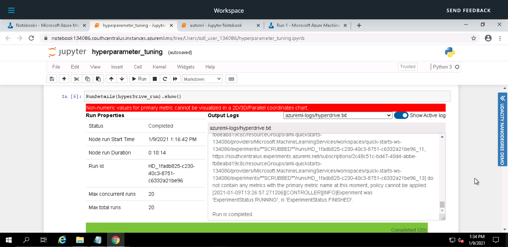
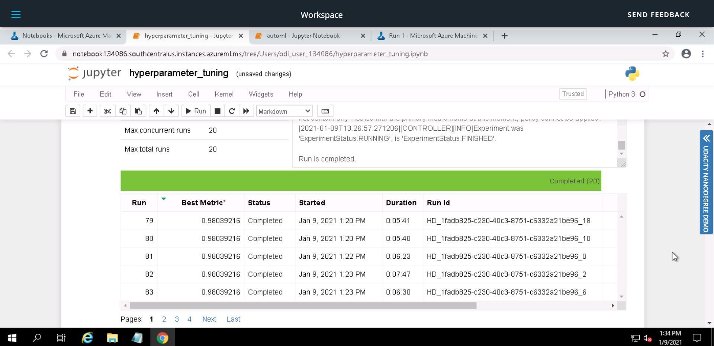
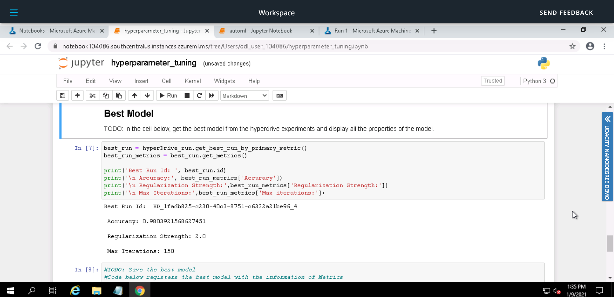

# Capstone Project: Azure Machine Learning Engineer

This is the Capstone project (last of the three projects) required for fulfillment of the Nanodegree Machine Learning Engineer with Microsoft Azure from Udacity. In this project, we use a dataset external to Azure ML ecosystem. 

Azure Machine Learning Service is used to train models using both hyperdrive and automl and then deployment and testing.

## Project Set Up and Installation
*OPTIONAL:* If your project has any special installation steps, this is where you should put it. To turn this project into a professional portfolio project, you are encouraged to explain how to set up this project in AzureML.

## Dataset

### Overview
In this dataset, we predict divorce among couples by using the Divorce Predictors Scale (DPS) on the basis of [Gottman couples therapy](https://www.gottman.com/blog/an-introduction-to-the-gottman-method-of-relationship-therapy/). The data was collected from seven different regions of Turkey, predominantly from the Black Sea region. Of the participants, 84 (49%) were divorced and 86 (51%) were married couples. Divorced participants answered the scale items by considering their marriages whereas, of the married participants, only those with happy marriages, without any thought of divorce, were included in the study.

The dataset consists of 170 rows and 54 columns. You can read further about the dataset [here](https://dergipark.org.tr/en/pub/nevsosbilen/issue/46568/549416)

Download dataset from [here](https://archive.ics.uci.edu/ml/datasets/Divorce+Predictors+data+set)

### Task
*TODO*: Explain the task you are going to be solving with this dataset and the features you will be using for it.

We have a classification problem at hand. The dataset has 54 attributes/features used for prediction. The attributes are described as below.

1. If one of us apologizes when our discussion deteriorates, the discussion ends.
2. I know we can ignore our differences, even if things get hard sometimes.
3. When we need it, we can take our discussions with my spouse from the beginning and correct it.
4. When I discuss with my spouse, to contact him will eventually work.
5. The time I spent with my wife is special for us.
6. We don't have time at home as partners.
7. We are like two strangers who share the same environment at home rather than family.
8. I enjoy our holidays with my wife.
9. I enjoy traveling with my wife.
10. Most of our goals are common to my spouse.
11. I think that one day in the future, when I look back, I see that my spouse and I have been in harmony with each other.
12. My spouse and I have similar values in terms of personal freedom.
13. My spouse and I have similar sense of entertainment.
14. Most of our goals for people (children, friends, etc.) are the same.
15. Our dreams with my spouse are similar and harmonious.
16. We're compatible with my spouse about what love should be.
17. We share the same views about being happy in our life with my spouse
18. My spouse and I have similar ideas about how marriage should be
19. My spouse and I have similar ideas about how roles should be in marriage
20. My spouse and I have similar values in trust.
21. I know exactly what my wife likes.
22. I know how my spouse wants to be taken care of when she/he sick.
23. I know my spouse's favorite food.
24. I can tell you what kind of stress my spouse is facing in her/his life.
25. I have knowledge of my spouse's inner world.
26. I know my spouse's basic anxieties.
27. I know what my spouse's current sources of stress are.
28. I know my spouse's hopes and wishes.
29. I know my spouse very well.
30. I know my spouse's friends and their social relationships.
31. I feel aggressive when I argue with my spouse.
32. When discussing with my spouse, I usually use expressions such as ‘you always’ or ‘you never’ .
33. I can use negative statements about my spouse's personality during our discussions.
34. I can use offensive expressions during our discussions.
35. I can insult my spouse during our discussions.
36. I can be humiliating when we discussions.
37. My discussion with my spouse is not calm.
38. I hate my spouse's way of open a subject.
39. Our discussions often occur suddenly.
40. We're just starting a discussion before I know what's going on.
41. When I talk to my spouse about something, my calm suddenly breaks.
42. When I argue with my spouse, ı only go out and I don't say a word.
43. I mostly stay silent to calm the environment a little bit.
44. Sometimes I think it's good for me to leave home for a while.
45. I'd rather stay silent than discuss with my spouse.
46. Even if I'm right in the discussion, I stay silent to hurt my spouse.
47. When I discuss with my spouse, I stay silent because I am afraid of not being able to control my anger.
48. I feel right in our discussions.
49. I have nothing to do with what I've been accused of.
50. I'm not actually the one who's guilty about what I'm accused of.
51. I'm not the one who's wrong about problems at home.
52. I wouldn't hesitate to tell my spouse about her/his inadequacy.
53. When I discuss, I remind my spouse of her/his inadequacy.
54. I'm not afraid to tell my spouse about her/his incompetence.

### Access
*TODO*: Explain how you are accessing the data in your workspace.
The dataset has been uploaded into this github repository and it can be accessed using the link as below:
https://raw.githubusercontent.com/khalidw/Capstone-Project-Azure-Machine-Learning-Engineer/master/divorce.csv

## Automated ML
*TODO*: Give an overview of the `automl` settings and configuration you used for this experiment

### Results
*TODO*: What are the results you got with your automated ML model? What were the parameters of the model? How could you have improved it?

### AutoML Screenshots
*TODO* Remeber to provide screenshots of the `RunDetails` widget as well as a screenshot of the best model trained with it's parameters

**Run Details Widget**

## Hyperparameter Tuning
*TODO*: What kind of model did you choose for this experiment and why? Give an overview of the types of parameters and their ranges used for the hyperparameter search

### Results
*TODO*: What are the results you got with your model? What were the parameters of the model? How could you have improved it?

### Hyperparameter Tuning Screenshots
*TODO* Remeber to provide screenshots of the `RunDetails` widget as well as a screenshot of the best model trained with it's parameters.

**Run Details Widget**

**Best Model**

## Model Deployment
*TODO*: Give an overview of the deployed model and instructions on how to query the endpoint with a sample input.

## Screen Recording
*TODO* Provide a link to a screen recording of the project in action. Remember that the screencast should demonstrate:
- A working model
- Demo of the deployed  model
- Demo of a sample request sent to the endpoint and its response

## Standout Suggestions
*TODO (Optional):* This is where you can provide information about any standout suggestions that you have attempted.

## Citation
Yöntem, M , Adem, K , İlhan, T , Kılıçarslan, S. (2019). DIVORCE PREDICTION USING CORRELATION BASED FEATURE SELECTION AND ARTIFICIAL NEURAL NETWORKS. Nevşehir Hacı Bektaş Veli University SBE Dergisi, 9 (1), 259-273.
